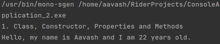
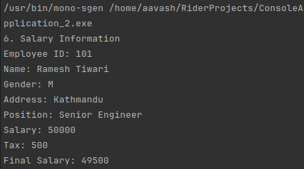
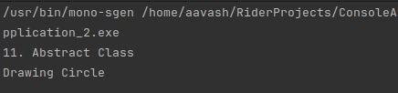

# Lab 1:

1. **Write a program to demonstrate class, constructor, properties and method.**

## Code:

```cpp
using System;

namespace Practical1
{
    class Person
    {
        private String name;
        private int age;
        // properties
        public String Name
        {
            get { return name; }
            set { name = value; }
        }
        public int Age
        {
            get { return age; }
            set { age = value; }
        }
        // constructor
        public Person(String name, int age)
        {
            this.name = name;
            this.age = age;
        }
        // method
        public void Greetings()
        {
            Console.WriteLine("Hello, my name is " + name + " and I am " + age + 
            " years old.");
        }
    }
}

using System;

namespace ConsoleApplication_2
{
    internal class Program
    {
        public static void Main(string[] args)
        {
            // Question 1
            Console.WriteLine("1. Class, Constructor, Properties and Methods");
            Person person = new Person("Aavash", 22);
            person.Greetings();
            Console.ReadKey();
        }
    }
}
```

## Output:

{ width=400px }

2. **Write a program to demonstrate method overloading.**

## Code:

```cpp
using System;

namespace ConsoleApplication_2
{
    class Calculator
    {
        // method to add two integers
        public int Add(int a, int b)
        {
            return a + b;
        }
        // method to add three integers
        public int Add(int a, int b, int c)
        {
            return a + b + c;
        }
        // method to add two doubles
        public double Add(double a, double b)
        {
            return a + b;
        }
    }
}

using System;

namespace ConsoleApplication_2
{
    internal class Program
    {
        public static void Main(string[] args)
        {
            Console.WriteLine("2. Method Overloading");
            Calculator calculator = new Calculator();
            Console.WriteLine(calculator.Add(10, 20));
            Console.WriteLine(calculator.Add(10, 20, 30));
            Console.WriteLine(calculator.Add(10.5, 20.5));
            Console.ReadKey();
        }
    }
}

```

## Output:

{ width=400px }

3. **Create a class Calculate which contains data member num1 and num2 both in integer and methods setCalc() to set the data, calcSum() that calculate the sum of num1 and num2 and display the result, calcMulti() that calculate the multiplication of num1 and num2 and returns the result, calcDifference that calculate the difference between num1 and num2 and display the result. Now, create some instance of Calculate and invoke all the methods.**

## Code:

```cpp
using System;

namespace ConsoleApplication_2
{
    class Calculate
    {
        private int num1;
        private int num2;

        // method to set the data
        public void setCalc(int num1, int num2)
        {
            this.num1 = num1;
            this.num2 = num2;
        }

        // method to calculate the sum of num1 and num2 and display the result
        public void calcSum()
        {
            int sum = num1 + num2;
            Console.WriteLine("Sum of " + num1 + " and " + num2 + " is " + sum);
        }

        // method to calculate the multiplication of num1 and num2 and returns result
        public int calcMulti()
        {
            return num1 * num2;
        }

        // method to calculate the difference between num1 and num2 and display 
        the result
        public void calcDifference()
        {
            int diff = num1 - num2;
            Console.WriteLine("Difference of " + num1 + " and " + num2 + " is " + diff);
        }
    }
}

using System;

namespace ConsoleApplication_2
{
    internal class Program
    {
        public static void Main(string[] args)
        {
            Console.WriteLine("3. Different arithmetic operations using class");
            Calculate calculate = new Calculate();
            calculate.setCalc(10, 5);
            calculate.calcSum();
            Console.WriteLine("Multiplication of 10 and 5 is " + calculate.calcMulti());
            calculate.calcDifference();
        }
    }
}
```

## Output:

{ width=400px }

4. **Create a class Number having instance variable x and y both in integer, default constructor that set the value of x and y to 0, parameterized constructor that sets the value of x and y, method findOdd() that calculates the even no. occurring between x and y and display the result, findEven() that calculates the odd no. occurring between x and y and display the results. Now, create some instance of Number and invoke all the methods.**

## Code:

```cpp
using System;
namespace ConsoleApplication_2
{
    class Number
    {
        // Instance variables
        private int x;
        private int y;

        // Default constructor setting x and y to 0
        public Number()
        {
            x = 0;
            y = 0;
        }

        // Parameterized constructor setting x and y
        public Number(int x, int y)
        {
            this.x = x;
            this.y = y;
        }

        // Method to find and display even numbers between x and y
        public void FindEven()
        {
            Console.Write("Even numbers between " + x + " and " + y + ": ");
            for (int i = x; i <= y; i++)
            {
                if (i % 2 == 0)
                {
                    Console.Write(i + " ");
                }
            }
            Console.WriteLine();
        }

        // Method to find and display odd numbers between x and y
        public void FindOdd()
        {
            Console.Write("Odd numbers between " + x + " and " + y + ": ");
            for (int i = x; i <= y; i++)
            {
                if (i % 2 != 0)
                {
                    Console.Write(i + " ");
                }
            }
            Console.WriteLine();
        }
    }
}

using System;

namespace ConsoleApplication_2
{
    internal class Program
    {
        public static void Main(string[] args)
        {
            Console.WriteLine("4. Even and Odd number");
            Number number = new Number(10, 20);
            number.FindEven();
            number.FindOdd();
        }
    }
}
```

## Output:

{ width=400px }

5. **Create a class Shape that contains instance variable length, breadth and height. Create a default constructor that sets the value of instance variable to zero, constructor with two parameter that will sets the value of length and breadth only and constructor with three parameter that will sets the value of length, breadth and height. After this create calcAreaRectangle() that calculates the area of rectangle, calcVolumeBox() that calculates volume of box and display the result. Now create first object of Shape wihich will have name rectangle and calls constructor with two parameter and calAreaRectangle() method, create second object of Shape that will have name Box which will call constructor with three parameter and calcVolumeBox() method.**

## Code:

```cpp
using System;
namespace ConsoleApplication_2
{
    class Shape
    {
        // Instance variables
        private double length;
        private double breadth;
        private double height;

        // Default constructor setting length, breadth, and height to 0
        public Shape()
        {
            length = 0;
            breadth = 0;
            height = 0;
        }

        // Constructor with two parameters for length and breadth
        public Shape(double length, double breadth)
        {
            this.length = length;
            this.breadth = breadth;
            height = 0; // Setting height to 0
        }

        // Constructor with three parameters for length, breadth, and height
        public Shape(double length, double breadth, double height)
        {
            this.length = length;
            this.breadth = breadth;
            this.height = height;
        }

        // Method to calculate and display the area of a rectangle
        public void CalcAreaRectangle()
        {
            double area = length * breadth;
            Console.WriteLine("Area of rectangle: " + area);
        }

        // Method to calculate and display the volume of a box
        public void CalcVolumeBox()
        {
            double volume = length * breadth * height;
            Console.WriteLine("Volume of box: " + volume);
        }
    }
}

using System;

namespace ConsoleApplication_2
{
    internal class Program
    {
        public static void Main(string[] args)
        {
            Console.WriteLine("5. Area of Rectangle and Volume of Box");
            Shape rectangle = new Shape(10, 20);
            rectangle.CalcAreaRectangle();
            Shape box = new Shape(10, 20, 30);
            box.CalcVolumeBox();
        }
    }
}
```

## Output:

{ width=400px }

6. **Create a class EmployeeDetails having data member empId, empName, empGender, empAddress, and empPosition, constructor to set the details and display method to display the details. Create a subclass SalaryInfo that will inherit EmployeeDetails having own data member salary which will record salary per year, constructor to set the value of salary and method calcTax() that deduct the tax on salary and display the final salary. Tax rate is given as (if salary <= 400000 tax is 1%, salary between 400001 to 800000 tax is 10% and salary > 800000 tax 20%). Now create the object of Salary info and demonstrate the scenario.**

## Code:

```cpp
using System;
namespace ConsoleApplication_2
{
    class EmployeeDetails
    {
        protected int empId;
        protected string empName;
        protected char empGender;
        protected string empAddress;
        protected string empPosition;

        // Constructor to set the details
        public EmployeeDetails(int empId, string empName, char empGender, string empAddress, string empPosition)
        {
            this.empId = empId;
            this.empName = empName;
            this.empGender = empGender;
            this.empAddress = empAddress;
            this.empPosition = empPosition;
        }

        // Method to display the details
        public virtual void DisplayDetails()
        {
            Console.WriteLine($"Employee ID: {empId}");
            Console.WriteLine($"Name: {empName}");
            Console.WriteLine($"Gender: {empGender}");
            Console.WriteLine($"Address: {empAddress}");
            Console.WriteLine($"Position: {empPosition}");
        }
    }

    class SalaryInfo : EmployeeDetails
    {
        // Additional data member
        private double salary;

        // Constructor to set the value of salary
        public SalaryInfo(int empId, string empName, char empGender, string empAddress, string empPosition, double salary)
            : base(empId, empName, empGender, empAddress, empPosition)
        {
            this.salary = salary;
        }

        // Method to calculate tax and display the final salary
        public void CalcTax()
        {
            double tax = 0;
            if (salary <= 400000)
            {
                tax = salary * 0.01;
            }
            else if (salary > 400000 && salary <= 800000)
            {
                tax = salary * 0.1;
            }
            else
            {
                tax = salary * 0.2;
            }

            double finalSalary = salary - tax;

            Console.WriteLine($"Salary: {salary}");
            Console.WriteLine($"Tax: {tax}");
            Console.WriteLine($"Final Salary: {finalSalary}");
        }
    }
}
using System;

namespace ConsoleApplication_2
{
    internal class Program
    {
        public static void Main(string[] args)
        {
            Console.WriteLine("6. Salary Information");
            SalaryInfo employee = new SalaryInfo(101, "Ramesh Tiwari", 'M', "Kathmandu", "Senior Engineer", 50000);
            employee.DisplayDetails();
            employee.CalcTax();
        }
    }
}
```

## Output:

{ width=400px }

7. **Write a program to demonstrate single level, multilevel inheritance.**

## Code:

```cpp
using System;
namespace ConsoleApplication_2
{
    // Base class
    class Animal
    {
        public void Eat()
        {
            Console.WriteLine("Animal is eating...");
        }
    }

    // Single-level inheritance
    class Dog : Animal
    {
        public void Bark()
        {
            Console.WriteLine("Dog is barking...");
        }
    }

    // Multi-level inheritance
    class Chiuaua : Dog
    {
        public void SmallBark()
        {
            Console.WriteLine("Chiuaua is barking...");
        }
    }
}
using System;

namespace ConsoleApplication_2
{
    internal class Program
    {
        public static void Main(string[] args)
        {
            Console.WriteLine("7. Inheritance");
            Dog dog = new Dog();
            dog.Eat();
            dog.Bark();

            Chiuaua chiuaua = new Chiuaua();
            chiuaua.Eat();
            chiuaua.Bark();
            chiuaua.SmallBark();
        }
    }
}
```

## Output:

{ width=400px }

8. **Write a program to demonstrate use of base keyword.**

## Code:

```cpp
using System;
namespace ConsoleApplication_2
{
    class Base
    {
        private int id;
        public Base(int id)
        {
            this.id = id;
            Console.WriteLine(id);
        }
    }

    class Derived : Base
    {
        public Derived(int id) : base(id) { }
    }
}

using System;

 namespace ConsoleApplication_2
 {
     internal class Program
     {
         public static void Main(string[] args)
         {
             Console.WriteLine("8. Use of base keyword");
             Base baseObj = new Base(10);
             Derived derivedObj = new Derived(20);
         }
     }
 }
```

## Output:

{ width=400px }

9. **Write a program to demonstrate method overriding (dynamic polymorphism).**

## Code:

```cpp
using System;
namespace ConsoleApplication_2
{
    class Parent
    {
        public virtual void Display()
        {
            Console.WriteLine("Parent's Display() method");
        }
    }

    class Child : Parent
    {
        public override void Display()
        {
            Console.WriteLine("Child's Display() method");
        }
    }
}
using System;

 namespace ConsoleApplication_2
 {
     internal class Program
     {
         public static void Main(string[] args)
         {
             Console.WriteLine("9. Method Overriding");
             Parent parent = new Child();
             parent.Display();
         }
     }
 }
```

## Output:

{ width=400px }

10. **Write a program to demonstrate multiple inheritance using interface.**

## Code:

```cpp
using System;
namespace ConsoleApplication_2
{
    public interface IShape
    {
        void Draw();
    }

    public interface IColor
    {
        void FillColor();
    }

    public class Circle : IShape, IColor
    {
        public void Draw()
        {
            Console.WriteLine("Drawing Circle");
        }

        public void FillColor()
        {
            Console.WriteLine("Filling color in Circle");
        }
    }
}
using System;

 namespace ConsoleApplication_2
 {
     internal class Program
     {
         public static void Main(string[] args)
         {
             Console.WriteLine("10. Multiple Inheritance using Interface");
             Circle circle = new Circle();
             circle.Draw();
             circle.FillColor();
         }
     }
 }
```

## Output:

{ width=400px }

11. **Write a program to demonstrate abstract class.**

## Code:

```cpp
using System;
namespace ConsoleApplication_2
{
    public abstract class NewShape
    {
        public abstract void Draw();
    }

    class NewCircle : NewShape
    {
        public override void Draw()
        {
            Console.WriteLine("Drawing Circle");
        }
    }
}

using System;

 namespace ConsoleApplication_2
 {
     internal class Program
     {
         public static void Main(string[] args)
         {
             Console.WriteLine("11. Abstract Class");
             NewShape shape = new NewCircle();
             shape.Draw();
         }
     }
 }
```

## Output:

{ width=400px }

12. **Write a program to demonstrate exception handline (try, catch, throw throws).**

## Code:

```cpp
using System;

namespace ConsoleApplication_2
{
    class ExceptionHandling
    {
        static int a = 10;
        static int b = 0;
        public void Divide()
        {
            try
            {
                int result = a / b;
                Console.WriteLine("Result: " + result);
            }
            catch (DivideByZeroException e)
            {
                Console.WriteLine("Divide by zero exception caught");
            }
            finally
            {
                Console.WriteLine("Finally block executed");
            }
        }
    }
}
using System;

 namespace ConsoleApplication_2
 {
     internal class Program
     {
         public static void Main(string[] args)
         {
             Console.WriteLine("12. Exception Handling");
             ExceptionHandling eh = new ExceptionHandling();
             eh.Divide();
         }
     }
 }
```

## Output:

{ width=400px }

13. **Write a program to demonstrate interface.**

## Code:

```cpp
using System;
namespace ConsoleApplication_2
{
    interface IPerson
    {
        void Greetings();
    }

    class Ram : IPerson
    {
        public void Greetings()
        {
            Console.WriteLine("Hello, I am Ram.");
        }
    }
}
using System;

 namespace ConsoleApplication_2
 {
     internal class Program
     {
         public static void Main(string[] args)
         {
             Console.WriteLine("13. Interface");
             Ram ram = new Ram();
             ram.Greetings();
         }
     }
 }
```

## Output:

{ width=400px }

14. **Write a program to demonstrate lamda expression.**

## Code:

```cpp
using System;
namespace ConsoleApplication_2
{
    delegate int MathOperation(int x, int y);
    class LambdaExpression
    {
        public void Lambda()
        {
            MathOperation add = (x, y) => x + y;
            Console.WriteLine(add(10, 20));
        }
    }
}
using System;

 namespace ConsoleApplication_2
 {
     internal class Program
     {
         public static void Main(string[] args)
         {
             Console.WriteLine("14. Lambda Expression");
             LambdaExpression lambda = new LambdaExpression();
             lambda.Lambda();
         }
     }
 }
```

## Output:

{ width=400px }

\newpage

# Lab 2:

1. **Create a web form that contains two label that display Enter first number and enter second number, two text box for taking an input, third text box for output and three button add, subtract and find prime. Add proper validation like text box should not be empty, value of first field should be greater than value of second field. If add button is clicked display the addition of two number given in textboxes, if subtract button is clicked display the subtraction of two number given in textboxes and if findprime is clicked then display the prime number from first value to second value given in textboxes.**

## Code:

```cpp

// operation.aspx

<%@ Page Language="C#" AutoEventWireup="true" CodeBehind="operation.aspx.cs" Inherits="Lab2.Operation" %>

<!DOCTYPE html>
<html xmlns="http://www.w3.org/1999/xhtml">
<head runat="server">
    <title></title>
</head>
<body>
    <form id="operationsForm" runat="server">
        <div>
            <asp:Label ID="firstNumberLabel" Text="Enter first number" 
            runat="server"></asp:Label>
            <asp:TextBox ID="firstNumber" runat="server"></asp:TextBox>
        </div>
            <div>
            <asp:Label ID="secondNumberLabel" Text="Enter second number" 
            runat="server"></asp:Label>
            <asp:TextBox ID="secondNumber" runat="server"></asp:TextBox>
        </div>
        <div>
            <asp:TextBox ID="output" runat="server"></asp:TextBox>
        </div>
        <div>
            <asp:Button ID="addButton" Text="Add" runat="server" 
            OnClick="addButton_Click" />
            <asp:Button ID="subtractButton" Text="Subtract" runat="server"
             OnClick="subtractButton_Click" />
            <asp:Button ID="primeButton" Text="Find Prime" runat="server"
             OnClick="primeButton_Click" />
        </div>
    </form>
</body>
</html>


// operation.aspx.cs

using System;
using System.Collections.Generic;
using System.Linq;
using System.Web;
using System.Web.UI;
using System.Web.UI.WebControls;
namespace Lab2
{
    public partial class Operation : System.Web.UI.Page
    {
        protected void Page_Load(object sender, EventArgs e)
        {
        }
        // Validation function
        private (int firstNumber, int secondNumber) validateNumbers(
            object sender, EventArgs e)
        {
            string firstNumberString = firstNumber.Text;
            string secondNumberString = secondNumber.Text;
            // check if the input fields are empty
            if (!firstNumberString.Equals("") && !secondNumberString.Equals(""))
            {
                // check if the input fields are numbers
                if (int.TryParse(firstNumberString, out int firstNumber) 
                && int.TryParse(secondNumberString, out int secondNumber))
                {
                    return (firstNumber, secondNumber);
                }
                else
                {
                    output.Text = "Please enter valid numbers";
                    return (0, 0);
                }
            }
            else
            {
                output.Text = "Please enter numbers";
                return (0, 0);
            }
        }
        // Add button click event
        protected void addButton_Click(object sender, EventArgs e)
        {
            int firstNumber, secondNumber;
            (firstNumber, secondNumber) = validateNumbers(sender, e);
                if (firstNumber == 0 && secondNumber == 0){
                    return;
                }
            output.Text = (firstNumber + secondNumber).ToString();
        }
        // Subtract button click event
        protected void subtractButton_Click(object sender, EventArgs e)
        {
            int firstNumber, secondNumber;
            (firstNumber, secondNumber) = validateNumbers(sender, e);
            if (firstNumber == 0 && secondNumber == 0)
            {
                return;
            }
            if (firstNumber < secondNumber)
            {
                output.Text = "First number should be greater than the second number";
                return;
            }
            output.Text = (firstNumber - secondNumber).ToString();
        }
        // Find Prime button click event
        protected void primeButton_Click(object sender, EventArgs e)
        {
            int firstNumber, secondNumber;
            (firstNumber, secondNumber) = validateNumbers(sender, e);
            if (firstNumber == 0 && secondNumber == 0)
            {
                return;
            }
            output.Text = "";
            for (int i = firstNumber; i <= secondNumber; i++)
            {
                if (isPrime(i)) output.Text += i + " ";
            }
        }
        // Check if the number is prime
        private bool isPrime(int number)
        {
            if (number <= 1)
                return false;
            for (int i = 2; i <= Math.Sqrt(number); i++)
            {
                if (number % i == 0)
                    return false;
            }
            return true;
        }
    }
}

```

## Output:

{ width=400px }

2. **Write a console program (ADO.net) to create a table tbl_registration that have fields (id int primary key, username, password, repassword, gender, course and country). After this perform the following operation**
- **Insert any 5 data into tbl_registration. All the required input should be taken from user**
- **Display all the record of database table**
- **Update the name and course of a person to data given by user according to id given by user**
- **Delete the record of person whose id is given by user**
- **Display all the record of person who are male and also from country Nepal**

## Code:

```cpp
using System;
using System.Collections.Generic;
using System.Data.SqlClient;
using System.Linq;
using System.Text;
using System.Threading.Tasks;
namespace lab2ado
{
    class Registration
    {
        // Method to create connection
        public SqlConnection CreateConnection()
        {
            string connectionString = "Data Source=AAVASH;Initial Catalog=db_lab;Integrated Security=True";
            SqlConnection conn = new SqlConnection(connectionString);
            return conn;
        }
        // Method to create table
        public void CreateTable()
        {
            SqlConnection conn = CreateConnection();
            try
            {
                conn.Open();
                string createTableQuery = "CREATE TABLE tbl_registration(" +
                    "id INT PRIMARY KEY IDENTITY(1, 1)," +
                    "username VARCHAR(50)," +
                    "password VARCHAR(50)," +
                    "repassword VARCHAR(50)," +
                    "gender VARCHAR(10)," +
                    "course VARCHAR(50)," +
                    "country VARCHAR(50)" +
                    ")";
                SqlCommand sc = new SqlCommand(createTableQuery, conn);
                int res = sc.ExecuteNonQuery();
                Console.WriteLine("Table created successfully");
            }
            catch (SqlException ex)
            {
                Console.WriteLine(ex);
            }
            finally
            {
                conn.Close();
            }
        }
        // Method to insert data
        public void InsertData()
        {
            SqlConnection conn = CreateConnection();
            try
            {
                conn.Open();
                // Taking input from user
                Console.Write("Enter username: ");
                string username = Console.ReadLine();
                Console.Write("Enter password: ");
                string password = Console.ReadLine();
                Console.Write("Re-enter password: ");
                string repassword = Console.ReadLine();
                if (password != repassword)
                {
                    Console.WriteLine("Password and re-entered password do not match");
                    return;
                }
                Console.Write("Enter gender: ");
                string gender = Console.ReadLine();
                Console.Write("Enter course: ");
                string course = Console.ReadLine();
                Console.Write("Enter country: ");
                string country = Console.ReadLine();
                // Inserting data into table
                string insertQuery = "INSERT INTO tbl_registration
                (username, password, repassword, gender, course, country)" +
                    
                "VALUES(@username, @password, @repassword, @gender, 
                @course, @country)";
                SqlCommand sc = new SqlCommand(insertQuery, conn);
                sc.Parameters.AddWithValue("@username", username);
                sc.Parameters.AddWithValue("@password", password);
                sc.Parameters.AddWithValue("@repassword", repassword);
                sc.Parameters.AddWithValue("@gender", gender);
                sc.Parameters.AddWithValue("@course", course);
                sc.Parameters.AddWithValue("@country", country);
                int res = sc.ExecuteNonQuery();
                if (res > 0)
                {
                    Console.WriteLine("Data inserted successfully");
                }
                else
                {
                    Console.WriteLine("Data not inserted");
                }
            }
            catch (Exception ex)
            {
                Console.WriteLine(ex);
            }
            finally
            {
                conn.Close();
            }
        }
        // Method to display data
        public void DisplayData()
        {
            SqlConnection conn = CreateConnection();
            try
            {
                conn.Open();
                string selectQuery = "SELECT * FROM tbl_registration";
                SqlCommand sc = new SqlCommand(selectQuery, conn);
                SqlDataReader res = sc.ExecuteReader();
                Console.WriteLine("Data from table:");
                while (res.Read())
                {
                    Console.WriteLine("Id: " + res["id"]);
                    Console.WriteLine("Username: " + res["username"]);
                    Console.WriteLine("Password: " + res["password"]);
                    Console.WriteLine("Repassword: " + res["repassword"]);
                    Console.WriteLine("Gender: " + res["gender"]);
                    Console.WriteLine("Course: " + res["course"]);
                    Console.WriteLine("Country: " + res["country"]);
                    Console.WriteLine();
                }
            }
            catch (SqlException ex)
            {
                Console.WriteLine(ex);
            }
            finally
            {
                conn.Close();
            }
        }
        // Method to update username and course of a person according to given id of user
        public void UpdateData()
        {
            SqlConnection conn = CreateConnection();
            try
            {
                conn.Open();
                Console.Write("Enter id of user to update: ");
                int id = Convert.ToInt32(Console.ReadLine());
                Console.Write("Enter new username: ");
                string username = Console.ReadLine();
                Console.Write("Enter new course: ");
                string course = Console.ReadLine();
                string updateQuery = "UPDATE tbl_registration 
                SET username = @username, course = @course WHERE id = @id";
                SqlCommand sc = new SqlCommand(updateQuery, conn);
                sc.Parameters.AddWithValue("@username", username);
                sc.Parameters.AddWithValue("@course", course);
                sc.Parameters.AddWithValue("@id", id);
                int res = sc.ExecuteNonQuery();
                if (res > 0)
                {
                    Console.WriteLine("Record updated successfully");
                }
                else
                {
                    Console.WriteLine("Record not found");
                }
            }
            catch (SqlException ex)
            {
                Console.WriteLine(ex);
            }
            finally
            {
                conn.Close();
            }
        }
        // delete record using id of user
        public void DeleteData()
        {
            SqlConnection conn = CreateConnection();
            try
            {
                conn.Open();
                Console.Write("Enter id of user to delete: ");
                int id = Convert.ToInt32(Console.ReadLine());
                string deleteQuery = "DELETE FROM tbl_registration 
                WHERE id = @id";
                SqlCommand sc = new SqlCommand(deleteQuery, conn);
                sc.Parameters.AddWithValue("@id", id);
                int res = sc.ExecuteNonQuery();
                if (res > 0)
                {
                    Console.WriteLine("Record deleted successfully");
                }
                else
                {
                    Console.WriteLine("Record not found");
                }
            }
            catch (SqlException ex)
            {
                Console.WriteLine(ex);
            }
            finally
            {
                conn.Close();
            }
        }
        // display all records of person who are male from country Nepal
        public void Display5()
        {
            SqlConnection conn = CreateConnection();
            try
            {
                conn.Open();
                string selectQuery = "SELECT * FROM tbl_registration WHERE gender='male' AND country='nepal'";
                SqlCommand sc = new SqlCommand(selectQuery, conn);
                SqlDataReader res = sc.ExecuteReader();
                while (res.Read())
                {
                    Console.WriteLine("Id: " + res["id"]);
                    Console.WriteLine("Username: " + res["username"]);
                    Console.WriteLine("Password: " + res["password"]);
                    Console.WriteLine("Repassword: " + res["repassword"]);
                    Console.WriteLine("Gender: " + res["gender"]);
                    Console.WriteLine("Course: " + res["course"]);
                    Console.WriteLine("Country: " + res["country"]);
                }
            }
            catch (SqlException ex)
            {
                Console.WriteLine(ex);
            }
            finally
            {
                conn.Close();
            }
        }
    }
    class Program
    {
        static void Main(string[] args)
        {
            Registration registration = new Registration();
            registration.CreateTable();
            for(int i = 0; i < 5; i++)
            {
            registration.InsertData();
            }
            registration.DisplayData();
            registration.UpdateData();
            registration.DisplayData();
            registration.DeleteData();

            registration.DisplayData();
            registration.Display5();
            Console.ReadKey();
        }
    }
}
```

## Output:

{ width=400px }

3. **For the table created in question no. 2, create a web form for registration which should contains username, password, repassword, gender (radio button), course (checkbox) and country (dropdown) and submit button.  When submit is pressed insert the value given by user into database table. Use proper validation: username, password and repassword should not be empty, item of radio button, checkbox and dropdown menu should be selected.**

## Code:

```cpp
// Register.aspx

<%@ Page Language="C#" AutoEventWireup="true" CodeBehind="Register.aspx.cs" Inherits="Regis3.Register" %>

<!DOCTYPE html>

<html xmlns="http://www.w3.org/1999/xhtml">
<head runat="server">
    <title>Registration Form</title>
</head>
<body>
    <form id="registrationForm" runat="server">
        <div>
            <asp:Label ID="usernameLabel" runat="server" Text="Username">
            </asp:Label>
            <asp:TextBox ID="username" runat="server"></asp:TextBox>
        </div>
        <div>
            <asp:Label ID="passwordLabel" runat="server" Text="Password">
            </asp:Label>
            <asp:TextBox ID="password" runat="server" TextMode="Password">
            </asp:TextBox>
        </div>
        <div>
            <asp:Label ID="rePasswordLabel" runat="server" Text="Re-Password">
            </asp:Label>
            <asp:TextBox ID="rePassword" runat="server" TextMode="Password">
            </asp:TextBox>
        </div>
        <div>
            <asp:Label ID="genderLabel" Text="Gender" runat="server">
            </asp:Label>
            <div>
                <asp:RadioButton ID="male" runat="server" Text="Male" GroupName="Gender" />
                <asp:RadioButton ID="female" runat="server" Text="Female" GroupName="Gender" />
            </div>
        </div>Register.aspx
<%@ Page Language="C#" AutoEventWireup="true" CodeBehind="Register.aspx.cs" Inherits="Regis3.Register" %>

<!DOCTYPE html>

<html xmlns="http://www.w3.org/1999/xhtml">
<head runat="server">
    <title>Registration Form</title>
</head>
<body>
    <form id="registrationForm" runat="server">
        <div>
            <asp:Label ID="usernameLabel" runat="server" Text="Username">
            </asp:Label>
            <asp:TextBox ID="username" runat="server"></asp:TextBox>
        </div>
        <div>
            <asp:Label ID="passwordLabel" runat="server" Text="Password">
            </asp:Label>
            <asp:TextBox ID="password" runat="server" TextMode="Password">
            </asp:TextBox>
        </div>
        <div>
            <asp:Label ID="rePasswordLabel" runat="server" Text="Re-Password">
            </asp:Label>
            <asp:TextBox ID="rePassword" runat="server" TextMode="Password">
            </asp:TextBox>
        </div>
        <div>
            <asp:Label ID="genderLabel" Text="Gender" runat="server">
            </asp:Label>
            <div>
                <asp:RadioButton ID="male" runat="server" Text="Male" GroupName="Gender" />
                <asp:RadioButton ID="female" runat="server" Text="Female" GroupName="Gender" />
            </div>
        </div>
        <div>
            <asp:Label ID="courses" Text="Courses" runat="server">
            </asp:Label>
            <asp:CheckBox ID="c" Text="C" runat="server" />
            <asp:CheckBox ID="cpp" Text="C++" runat="server" />
            <asp:CheckBox ID="java" Text="Java" runat="server" />
        </div>
        <div>
            <asp:Label ID="countryLabel" Text="Country" runat="server">
            </asp:Label>
            <asp:DropDownList ID="country" runat="server">
                <asp:ListItem Value="">Select your country</asp:ListItem>
                <asp:ListItem>Nepal</asp:ListItem>
                <asp:ListItem>India</asp:ListItem>
                <asp:ListItem>USA</asp:ListItem>
                <asp:ListItem>UK</asp:ListItem>
            </asp:DropDownList>
        </div>
        <div>
            <asp:Button ID="submit" Text="Submit" runat="server" OnClick="SignUp" />
        </div>
        <div>
            <asp:TextBox ID="result" runat="server"></asp:TextBox>
        </div>
    </form>
</body>
</html>

Register.aspx.cs
using System;
using System.Collections.Generic;
using System.Data.SqlClient;
using System.Linq;
using System.Web;
using System.Web.UI;
using System.Web.UI.WebControls;
namespace Regis3
{
    public partial class Register : System.Web.UI.Page
    {
        protected void Page_Load(object sender, EventArgs e)
        {
        }
        protected void SignUp(object sender, EventArgs e)
        {
            String usernameValue = username.Text;
            String passwordValue = password.Text;
            String rePasswordValue = rePassword.Text;
            // check if username and password are empty
            if (usernameValue == "" || passwordValue == "" || rePasswordValue == "")
            {
                result.Text = "Please fill all the fields";
                return;
            }
            // check if the password and confirm password are same
            if (passwordValue != rePasswordValue)
            {
                result.Text = "Passwords do not match";
                return;
            }
            // check if the gender is selected
            string gender; 
            // it is a radio button so we need to check which one is selected
            if (male.Checked)
            {
                gender = male.Text;
            }
            else if (female.Checked)
            {
                gender = female.Text;
            }
            else
            {
                result.Text = "Please select a gender";
                return;
            }
            // select courses
            string courses = "";
            // if none of the courses are selected, return an error
            if (!c.Checked && !cpp.Checked && !java.Checked)
            {
                result.Text = "Please select a course";
                return;
            }
            if (c.Checked)
            {
                courses += c.Text + ", ";
            }
            if (cpp.Checked)
            {
                courses += cpp.Text + ", ";
            }
            if (java.Checked)
            {
                courses += java.Text + ", ";
            }
            // check if the country is chosen
            string countryValue;
            if (country.SelectedValue != "")
            {
                countryValue = country.SelectedValue;
            }
            else
            {
                result.Text = "Please select a country";
                return;
            }
            string connectionString = "Data Source=AAVASH;Initial 
            Catalog=db_lab;Integrated Security=True";
            SqlConnection conn = new SqlConnection(connectionString);
            try
            {
                conn.Open();
                string query = "INSERT INTO tbl_registration (username, password,
                 repassword, gender, course, country) VALUES (" +
                    "@username, @password, @repassword, @gender, @courses, @country)";
                SqlCommand sc = new SqlCommand(query, conn);
                sc.Parameters.AddWithValue("@username", usernameValue);
                sc.Parameters.AddWithValue("@password", passwordValue);
                sc.Parameters.AddWithValue("@repassword", rePasswordValue);
                sc.Parameters.AddWithValue("@gender", gender);
                sc.Parameters.AddWithValue("@courses", courses);
                sc.Parameters.AddWithValue("@country", countryValue);
                int res = sc.ExecuteNonQuery();
                // reset the form
                username.Text = "";
                password.Text = "";
                rePassword.Text = "";
                // deselect the radio buttons
                male.Checked = false;
                female.Checked = false;
                // deselect the checkboxes
                c.Checked = false;
                cpp.Checked = false;
                java.Checked = false;
                // deselect the dropdown
                country.SelectedIndex = 0;
                if (res > 0)
                {
                    result.Text = "Registration successful";
                }
                else
                {
                    result.Text = "Registration failed";
                }
            }
            catch (SqlException ex)
            {
                result.Text = ex.Message;
            }
            finally
            {
                conn.Close();
            }
        }
    }
}

```

## Output:

{ width=400px }

\newpage

# Lab 3:

1. **Demonstrate model, view and controller by showing different action method, views, model, accessing controller, model and view.**

## Code:

```cpp
Models: Student.cs
namespace Lab3.Models
{
    public class Student
    {   
        public int Id { get; set; }
        public string Name { get; set; }
        public string Faculty { get; set; }
    }
}

Controllers: StudentController.cs
using Lab3.Models;
using Microsoft.AspNetCore.Mvc;
namespace Lab3.Controllers
{
    public class StudentController : Controller
    {
        public IActionResult Index()
        {
            List<Student> students = new List<Student>
            {
                new Student { Id= 1, Name="Popo", Faculty="CSIT" },
                new Student { Id= 2, Name="Avas", Faculty="BCA" }
            };
            return View(students);
        }
        public string HelloWorld()
        {
            return "Hello, World!";
        }
        public IActionResult PrintData(string name, string faculty)
        {
            ViewBag.Name = name;
            ViewBag.Faculty = faculty;
            return View();
        }
    }
}
Views: 
Index.cshtml
@using Lab3.Models

@{
    ViewData["Title"] = "Student Page";
}
<h1>Index page</h1>
<table border="1" cellpadding="3" cellspacing="0">
    <thead>
        <tr>
            <th>Id</th>
            <th>Name</th>
            <th>Faculty</th>
           
        </tr>
    </thead>
    <tbody>
        @foreach (Student student in Model)
        {
            <tr>

                <td>@student.Id</td>
                <td>@student.Name</td>
                <td>@student.Faculty</td>
               
            </tr>
        }
    </tbody>
</table>

PrintData.cshtml
@using Lab3.Models
@{
    string name = ViewBag.Name;
    string faculty = ViewBag.Faculty;   
}
<h1>Print Data</h1>
<h2>Name: @name</h2>
<h3>Faculty: @faculty</h3>
<span>Note: Add ?name="name"&faculty="faculty" to view the data.</span>

```

## Output:

{ width=400px }


2. **Demonstrate use of razor syntax**

## Code:

```cpp
Models: Product.cs
namespace Lab3.Models
{
    public class Product
    {
        public int Id { get; set; }
        public string Name { get; set; }
    }
}
Contollers: ProdcutController.cs
using Lab3.Models;
using Microsoft.AspNetCore.Mvc;
namespace Lab3.Controllers
{
    public class ProductController : Controller
    {
        public IActionResult Index()
        {
            Product product = new Product { Id = 1, Name = "Product A" };
                       return View(product);
            ;
        }
    }
}
Views: Index.cshtml
@using Lab3.Models
<h1>Product Id is: @Model.Id</h1>
<h1>Product Name is: @Model.Name</h1>
```

## Output:

{ width=400px }


3. **Demonstrate use of html tag helper**

## Code:

```cpp
Models: TagHelper.cs
namespace Lab3.Models{
    public class TagHelper    {
        public string Name { get; set; }    }}

Controllers: TagHelperController.cs
using Microsoft.AspNetCore.Mvc;
using Lab3.Models;
namespace Lab3.Controllers{
    public class TagHelperController : Controller    {
        [HttpGet]
        public IActionResult Index()        {
            return View();
        }
        [HttpPost]
        public IActionResult Index(TagHelper model)        {
            return View(model);        }    }}

Views: Index.cshtml
@model TagHelper
<!DOCTYPE html>
<html>
<head>    <title>Simple Form</title></head><body>
    <h1>Simple Form</h1>
    <form asp-action="Index" method="post">
        <div>            <label asp-for="Name"></label>
            <input asp-for="Name" class="form-control" />
        </div>        <div>
            <button type="submit" class="btn btn-primary">Submit</button>
        </div>    </form>
    @if (Model != null && !string.IsNullOrEmpty(Model.Name))    {
        <p>You entered: @Model.Name</p>
    }</body></html>

```

## Output:

{ width=400px }

4. **Using Entity framework create a table tbl_officer having field (id, name, gender, phone, department and position) after this perform complete CRUDE operation (insert, update, display and delete). User proper validation.**

## Code:

```cpp
Models: Officer.cs
namespace Lab3.Models
{
    public class Officer
    {
        public Guid Id { get; set; }
        public string Name { get; set; }
        public string Gender { get; set; }
        public string Phone { get; set; }
        public string Department { get; set; }
        public string Position { get; set; }
    }
}
OfficerContext.cs
using System.Collections.Generic;
using Microsoft.EntityFrameworkCore;
namespace Lab3.Models
{
    public class OfficerContext : DbContext
    {
        public OfficerContext(DbContextOptions<OfficerContext> options) : base(options) { }
        public DbSet<Officer> tbl_officer { get; set; } 
    }
}
	appsettings.json
	"ConnectionStrings": {
  	"cs": "Server=AAVASH;Database=db_officer;Trusted_Connection=true;Encrypt=fals"
}
Program.cs
builder.Services.AddDbContext<OfficerContext>(options=>options.UseSqlServer
(builder.Configuration.GetConnectionString("cs")));
In package manager console:
Add-migration new
Update-database

Controllers: OfficerController.cs
using Lab3.Models;
using Microsoft.AspNetCore.Mvc;
namespace Lab3.Controllers
{
    public class OfficerController : Controller
    {
        private readonly OfficerContext _context;
        public OfficerController(OfficerContext context)
        {
            _context = context;
        }
        [HttpGet]
        public IActionResult Index()
        {
            // data to be displayed in index.cshtml
            // data from the database will be converted to list and sent to view
            var officerList = _context.Tbl_officer.ToList();
            return View(officerList);
        }
        [HttpGet]
        public IActionResult CreateOfficer()
        {
            return View();
        }
        [HttpPost]
        public IActionResult CreateOfficer(Officer o)
        {
            var officer = new Officer()
            {
                Id = Guid.NewGuid(),
                Name = o.Name,
                Gender = o.Gender,
                Department = o.Department,
                Phone = o.Phone,
                Position = o.Position
            };
            _context.Tbl_officer.Add(officer);
            _context.SaveChanges();
            return RedirectToAction("Index");
        }
        [HttpGet]
        public IActionResult DisplayOfficer(Guid id)
        {
            var officer = _context.Tbl_officer.Find(id);
            if (officer == null)
            {
                return RedirectToAction("Index");
            }
            return View(officer);
        }
        [HttpGet]
        public IActionResult UpdateOfficer(Guid id)
        {
            // check if the id of officer sent from view is matched with the id in the database
            // if matched, the officer details will be sent to the view
            var officer = _context.Tbl_officer.FirstOrDefault(x => x.Id == id);
            if (officer == null)
            {
                return RedirectToAction("Index");
            }
            return View(officer);
        }
        [HttpPost]
        public IActionResult UpdateOfficer(Officer o)
        {
            // check if the officer details are valid
            // then save the changes in database
            var officer = _context.Tbl_officer.Find(o.Id);
            if (officer != null)
            {
                officer.Name = o.Name;
                officer.Gender = o.Gender;
                officer.Department = o.Department;
                officer.Phone = o.Phone;
                officer.Position = o.Position;
                _context.SaveChanges();
            }
            return RedirectToAction("Index");
        }
        [HttpGet]
        public IActionResult DeleteOfficer(Guid id)
        {
            // check if the id of officer sent from view is matched with the id in the database
            // if matched, the officer details will be sent to the view
            var officer = _context.Tbl_officer.FirstOrDefault(x => x.Id == id);
            if (officer != null)
            {
                _context.Tbl_officer.Remove(officer);
                _context.SaveChanges();
            }
            return RedirectToAction("Index");
        }
        [HttpPost]
        public IActionResult DeleteOfficer(Officer o)
        {
            // check if the officer details are valid
            // then delete the officer from the database
            var officer = _context.Tbl_officer.Find(o.Id);
            if (officer != null)
            {
                _context.Tbl_officer.Remove(officer);
                _context.SaveChanges();
            }
            return RedirectToAction("Index");
        }
    }
}
Views:
Index.cshtml
@model List<Lab3.Models.Officer>
@{
    ViewData["Title"] = "Officers List";
}
<h1>Officers List</h1>
<p>
    <a asp-action="CreateOfficer">Create New Officer</a>
</p>
<table class="table">
    <thead>
        <tr>
            <th>Name</th>
            <th>Gender</th>
            <th>Phone</th>
            <th>Department</th>
            <th>Position</th>
            <th>Actions</th>
        </tr>
    </thead>
    <tbody>
        @foreach (var item in Model)
        {
            <tr>
                <td>@item.Name</td>
                <td>@item.Gender</td>
                <td>@item.Phone</td>
                <td>@item.Department</td>
                <td>@item.Position</td>
                <td>
                    <a href="Officer/DisplayOfficer/@item.Id">Details</a> |
                    <a href="Officer/UpdateOfficer/@item.Id">Edit</a> |
                    
                </td>
<td>
    <form method="post" asp-route-id="@item.Id" asp-action="Delete">
        <input type="submit" value="delete" />
    </form>
</td>
            </tr>
        }
    </tbody>
</table>
CreateOfficer.cshtml
@model Lab3.Models.Officer
@{
    ViewData["Title"] = "Create Officer";
}
<h1>Create Officer</h1>
<h4>Officer</h4>
<hr />
<div>
    <div>
        <form asp-action="CreateOfficer">
            <div >
                <label asp-for="Name"></label>
                <input asp-for="Name" />
            </div>
            <div >
                <label asp-for="Gender"></label>
                <input asp-for="Gender" />
            </div>
            <div >
                <label asp-for="Phone"></label>
                <input asp-for="Phone" />
            </div>
            <div >
                <label asp-for="Department"></label>
                <input asp-for="Department" />
            </div>
            <div >
                <label asp-for="Position"></label>
                <input asp-for="Position" />
            </div>
            <div >
                <input type="submit" value="Create" />
            </div>
        </form>
    </div>
</div>
<div>
    <a asp-action="Index">Back to List</a>
</div>

DisplayOfficer.cshtml
@model Lab3.Models.Officer
@{
    ViewData["Title"] = "Officer Details";
}
<h1>Officer Details</h1>
<div>
    <h4>Officer</h4>
    <hr />
    <table>
        <thead>
            <tr>
                <th>Name</th>
                <th>Gender</th>
                <th>Phone</th>
                <th>Department</th>
                <th>Position</th>
            </tr>
        </thead>
        <tbody>
            <tr>
                <td>@Model.Name</td>
                <td>@Model.Gender</td>
                <td>@Model.Phone</td>
                <td>@Model.Department</td>
                <td>@Model.Position</td>
            </tr>
        </tbody>
    </table>
</div>
<div>
    <a asp-action="Index">Back to List</a>
</div>
UpdateOfficer.cshtml
@model Lab3.Models.Officer
@{
    ViewData["Title"] = "Update Officer";
}
<h1>Update Officer</h1>
<h4>Officer</h4>
<hr />
<div>
    <form asp-action="UpdateOfficer">
        <div>
            <label asp-for="Name"></label>
            <input asp-for="Name" />
        </div>
        <div>
            <label asp-for="Gender"></label>
            <input asp-for="Gender" />
        </div>
        <div>
            <label asp-for="Phone"></label>
            <input asp-for="Phone" />
        </div>
        <div>
            <label asp-for="Department"></label>
            <input asp-for="Department" />
        </div>
        <div>
            <label asp-for="Position"></label>
            <input asp-for="Position" />
        </div>        <div>
            <input type="submit" value="Save" />        
            </div>    </form></div><div>
    <a asp-action="Index">Back to List</a>
</div>

```

## Output:

{ width=400px }

{ width=400px }

{ width=400px }


5. **Demonstrate different state management technique like SessionState, TempData, HttpContext.**

## Code:

```cpp
Program.cs
builder.Services.AddSession();
app.UseSession();
Controllers:
SessionController.cs
using Microsoft.AspNetCore.Mvc;
namespace Lab3.Controllers
{
    public class SessionController : Controller
    {
        [HttpGet]
        public IActionResult Index()
        {
            var name = HttpContext.Session.GetString("Name");
            var email = HttpContext.Session.GetString("Email");
            // set the session values to ViewBag
            ViewBag.Name = name;
            ViewBag.Email = email;
            return View();
        }
        [HttpPost]
        public IActionResult Index(string name, string email)
        {
            HttpContext.Session.SetString("Name", name);
            HttpContext.Session.SetString("Email", email);
            return RedirectToAction("Index");
        }
        [HttpGet]
        public IActionResult Clear()
        {
            HttpContext.Session.Clear();
            return RedirectToAction("Index");
        }
    }
}
TempDataController.cs
using Microsoft.AspNetCore.Mvc;
namespace Lab3.Controllers
{
    public class TempDataController : Controller
    {
        public IActionResult Index()
        {
            TempData["Name"] = "Ram Singh";
            return View();
        }
        public IActionResult Second()
        {
            return View();
        }
        public IActionResult Third()
        {
            return View();
        }
    }
}
HttpContextController.cs
using Microsoft.AspNetCore.Http.Extensions;
using Microsoft.AspNetCore.Mvc;
namespace Lab3.Controllers
{
    public class HttpContextController : Controller
    {
        public string Index()
        {
            string URL = HttpContext.Request.GetDisplayUrl();
            return URL;
        }
        public string StatusCode()
        {
            return HttpContext.Response.StatusCode.ToString();
        }
    }
}
Views:
Session:Index.cshtml
@{
    ViewData["Title"] = "Session state management";
}
<h1>@ViewData["Title"]</h1>
@{
    if (!string.IsNullOrEmpty(ViewBag.name) && !string.IsNullOrEmpty
    (ViewBag.email))
    {
        <h3>Session data:</h3>
        <p>Name: @ViewBag.name</p>
        <p>Email: @ViewBag.email</p>
        <form asp-action="Clear">
            <button type="submit">Clear</button>
        </form>
    }
    else
    {
        <form asp-action="Index" method="post">
            <label for="name">Name:</label>
            <input type="text" id="name" name="name" />
            <label for="email">Email:</label>
            <input type="email" id="email" name="email" />
            <button type="submit">Set session</button>
        </form>
    }
}
Tempdata: Index.cshtml
@{
    ViewData["Title"] = "State management using TempData";
}
<h1>@ViewData["Title"]</h1>
@{
    <div>
        <a asp-action="Second">Second</a>
    </div>
    <div>
        <a asp-action="Third">Third</a>
    </div>
}
Second.cshtml
@{
    ViewData["Title"] = "Second";
    var name = TempData["Name"]?.ToString();
    TempData.Keep("Name");
}
<h1>Second</h1>
<p>Name: @name</p>
@{
    ViewData["Title"] = "State management using TempData";
}
<h1>@ViewData["Title"]</h1>
@{
    <div>
        <a asp-action="Third">Third</a>
    </div>
}
Third.cshtml
@{
    ViewData["Title"] = "Third";
    var name = TempData["Name"]?.ToString();
}
<h1>Third</h1>
<p>Name: @name</p>

```

## Output:

{ width=400px }

{ width=400px }

6. **Demonstrate different client-side state management like cookies, Query string and hidden fields**

## Code:

```cpp
Models: Hidden.cs
namespace Lab3.Models
{
    public class Hidden
    {
        public string Name { get; set; }
        public string HiddenField { get; set; }
    }
}
Controllers:
using Microsoft.AspNetCore.Mvc;
using System;
using Lab3.Models;
namespace Lab3.Controllers
{
    public class ClientStateController : Controller
    {
        public IActionResult Index()
        {
            return View();
        }
        public IActionResult SetCookie()
        {
            CookieOptions option = new CookieOptions();
            option.Expires = DateTime.Now.AddDays(1);
            Response.Cookies.Append("UserName", "CookieDemohere", option);
            return Content("Cookie has been set");
        }
        // Action to read a cookie
        public IActionResult ReadCookie()
        {
            string cookieValue = Request.Cookies["UserName"];
            if (!string.IsNullOrEmpty(cookieValue))
            {
                ViewBag.CookieValue = cookieValue;
            }
            else
            {
                ViewBag.CookieValue = "Cookie not found";
            }
            return View();
        }
        // Action to send query string
        public IActionResult SendQueryString()
        {
            return RedirectToAction("ReceiveQueryString", new 
            { userName = "Aavash" });
        }
        // Action to receive query string
        public IActionResult ReceiveQueryString(string userName)
        {
            ViewBag.UserName = userName;
            return View();
        }
        // GET: Action to display form
        [HttpGet]
        public IActionResult Create()
        {
            return View();
        }
        // POST: Action to handle form submission
        [HttpPost]
        public IActionResult SubmitForm(Hidden model)
        {
            ViewBag.Result = $"Name: {model.Name}, Hidden Field: 
            {model.HiddenField}";
            return View("Result");
        }
    }
}
Views:
SetCookie.cshtml
@{
    ViewBag.Title = "Set Cookie";
}
<h2>Set Cookie</h2>
<p>Cookie has been set. <a href="@Url.Action("ReadCookie")">Read Cookie</a></p>

ReadCookie.cshtml
@{
    ViewBag.Title = "Read Cookie";
}
<h2>Read Cookie</h2>
<p>@ViewBag.CookieValue</p>

ReceiveQueryString.cshtml
@{
    ViewBag.Title = "Receive Query String";
}
<h2>Receive Query String</h2>
<p>Query String Value: @ViewBag.UserName</p>

Create.cshtml
@model Lab3.Models.Hidden
@{
    ViewBag.Title = "Create Form";
}
<h2>Create Form</h2>
<form asp-action="SubmitForm" method="post">
    <div>
        <label asp-for="Name"></label>
        <input asp-for="Name" />
    </div>
    <div>
        <input type="hidden" asp-for="HiddenField" value="
        This is hidden field demo" />
    </div>
    <div>
        <input type="submit" value="Submit" />
    </div>
</form>

Result.cshtml
@{
    ViewBag.Title = "Form Result";
}
<h2>Form Result</h2>
<p>@ViewBag.Result</p>

Index.cshtml
<h1>Hello This is Client-side State Management</h1>
```

## Output:

{ width=400px }

{ width=400px }


7. **Write a program to create complete form and validate using jquery or react**

## Code:

```cpp
<!DOCTYPE html>
<html lang="en">
  <head>
    <meta charset="UTF-8" />
    <meta name="viewport" content="width=device-width, initial-scale=1.0" />
    <title>jQuery Login Form Validation</title>
    <script
      src="http://ajax.googleapis.com/ajax/libs/jquery/1.8.3/jquery.min.js"
      type="text/javascript"
    ></script>
    <script type="text/javascript">
      $(document).ready(function () {
        $("#loginForm").submit(function (event) {
          const name = $("#name").val();
          const password = $("#password").val();
          let valid = true;

          // Clear previous error messages
          $(".error").remove();

          // Check if the name field is empty
          if (name === "") {
            $("#name").after(
              '<span class="error">Please enter your name</span>'
            );
            valid = false;
          }

          // Check if the password field is empty
          if (password === "") {
            $("#password").after(
              '<span class="error">Please enter your password</span>'
            );
            valid = false;
          }

          // Check if the password is less than 6 characters
          if (password.length < 6) {
            $("#password").after(
              '<span class="error">Password must be at least 6 characters 
              long</span>'
            );
            valid = false;
          }

          // If any validation fails, prevent form submission
          if (!valid) {
            event.preventDefault();
          } else {
            alert("Login Successful");
          }
        });
      });
    </script>
    <style>
      .error {
        color: red;
        margin-left: 5px;
      }
    </style>
  </head>
  <body>
    <form id="loginForm">
      <!-- Name field -->
      <label for="name">Name:</label>
      <input type="text" id="name" name="name" />
      <br /><br />
      <!-- Password field -->
      <label for="password">Password:</label>
      <input type="password" id="password" name="password" />
      <br /><br />
      <button type="submit" id="submit">Submit</button>
    </form>
  </body>
</html>
```

## Output:

{ width=400px }

8. **Write a program to demonstrate authentication and authorization (Role, claim and policies) by create a complete form in asp.net core**

## Code:

```cpp
Program.cs
using Microsoft.AspNetCore.Authentication.Cookies;
// Authentication configuration using Cookies
builder.Services.AddAuthentication(CookieAuthenticationDefaults.AuthenticationScheme)
    .AddCookie(options =>
    {
        options.LoginPath = "/Home/Login"; // Configuring the login path
        options.AccessDeniedPath = "/Home/AccessDenied"; 
        // Configuring the access denied path
    });

// Authorization configuration using Policy
builder.Services.AddAuthorization(options =>
{
    options.AddPolicy("Admin", policy => policy.RequireRole("Admin"));
    options.AddPolicy("User", policy => policy.RequireRole("User"));
    options.AddPolicy("AdminOrUser", policy => 
    policy.RequireRole("Admin", "User"));
});

Controllers: HomeController.cs
using Microsoft.AspNetCore.Authentication;
using Microsoft.AspNetCore.Authentication.Cookies;
using Microsoft.AspNetCore.Authorization;
using System.Security.Claims;
using Labb3.Models;
using Microsoft.AspNetCore.Mvc;
using System.Diagnostics;
namespace Labb3.Controllers
{
    public class HomeController : Controller
    {
        private readonly ILogger<HomeController> _logger;
        public HomeController(ILogger<HomeController> logger)
        {
            _logger = logger;
        }
        public IActionResult AccessDenied()
        {
            return View();
        }
        public IActionResult Index()
        {
            return View();
        }
        [Authorize]
        public IActionResult Privacy()
        {
            return View();
        }
        [Authorize(Policy = "AdminOrUser")]
        public IActionResult Dashboard()
        {
            return View();
        }
        [Authorize(Roles = "User")]
        public IActionResult UserPage()
        {
            return View();
        }
        [Authorize(Roles = "Admin")]
        public IActionResult AdminPage()
        {
            return View();
        }
        [HttpGet]
        public IActionResult Login(string returnUrl)
        {
            // take the return url and store it in the viewbag
            ViewBag.ReturnUrl = returnUrl;
            return View();
        }
        [HttpPost]
        public IActionResult Login(string username, string password, string returnUrl)
        {
            // user "john" with "admin" role
            if (username == "Aavash" && password == "123")
            {
                List<Claim> claims = new List<Claim>();
                claims.Add(new Claim(ClaimTypes.NameIdentifier, username));
                claims.Add(new Claim(ClaimTypes.Name, username));
                claims.Add(new Claim(ClaimTypes.Role, "Admin"));
                ClaimsIdentity identity = new ClaimsIdentity(claims, CookieAuthenticationDefaults.AuthenticationScheme);
                ClaimsPrincipal principal = new ClaimsPrincipal(identity);
                HttpContext.SignInAsync(principal);
                return Redirect(returnUrl);
            }
            // user "doe" with "user" role
            if (username == "User" && password == "111")
            {
                List<Claim> claims = new List<Claim>();
                claims.Add(new Claim(ClaimTypes.NameIdentifier, username)); 
                // the nameidentifier is the unique identifier for the user
                claims.Add(new Claim(ClaimTypes.Name, username)); 
                // the name claimtypes is the name of the user
                claims.Add(new Claim(ClaimTypes.Role, "User"));
                ClaimsIdentity identity = new ClaimsIdentity(claims, CookieAuthenticationDefaults.AuthenticationScheme);
                ClaimsPrincipal principal = new ClaimsPrincipal(identity);
                HttpContext.SignInAsync(principal);
                return Redirect(returnUrl);
            }
            return View();
        }
        [ResponseCache(Duration = 0, Location = ResponseCacheLocation.None, 
        NoStore = true)]
        public IActionResult Error()
        {
            return View(new ErrorViewModel { RequestId = Activity.Current?.Id ??
             HttpContext.TraceIdentifier });
        }
    }
}

Views: Index.csthml
@{
    ViewData["Title"] = "Home Page";
}
<h1>This is Authentication and Authorization demo using Cookie Authentication.</h1>

Privacy.cshtml
@{
    ViewData["Title"] = "Privacy";
}
<h1>Welcome to @ViewData["Title"]</h1>
<p>This is privacy page which is only available to authenticated users.</p>

<p>It doesnot need authorization as users of all roles are given access to this page.</p>

AccessDenied.cshtml
@{
    ViewData["Title"] = "Access Denied";
}
<h1>@ViewData["Title"]</h1>
<p>You do not have permission to view this page.</p>

Dashboard.cshtml
@{
    ViewData["Title"] = "Dashboard";
}
<h1>Welcome to @ViewData["Title"]</h1>

<p>Page only available to authenticated users with roles "User" and "Admin".</p>

UserPage.cshtml
@{
    ViewData["Title"] = "User Page";
}
<h1>Welcome to @ViewData["Title"]</h1>
<p>Page only available to users with "User" role.</p>

AdminPage.cshtml
@{
    ViewData["Title"] = "Admin Page";
}
<h1>Welcome to @ViewData["Title"]</h1>
<p>Page only available to users with "Admin" role.</p>

Login.cshtml
@{
    string returnUrl = ViewBag.ReturnUrl;
}
<form method="post"
      action="Login?ReturnUrl=@System.Net.WebUtility.UrlEncode(returnUrl)">
    <input type="hidden" name="returnUrl" value="@returnUrl" />
    <div>
        <label>Username</label>
        <input type="text" name="username" /><br />
    </div>
    <div>
        <label>Password</label>
        <input type="password" name="password" /><br />
    </div>
    <input type="submit" name="submit" value="login" />
</form>
```

## Output:

{ width=400px }

9. **Write a program to prevent SQLInjectionAttack, Cross Site Request forgery (CSRF) and open redirect attack**

## Code:

```cpp
Program.cs
using Laab3.Models;
using Microsoft.AspNetCore.Antiforgery;
using Microsoft.EntityFrameworkCore;

builder.Services.AddDbContext<UserContext>(options =>
    options.UseSqlServer(builder.Configuration.GetConnectionString("cs")));
app.UseAuthentication();
app.Use(async (context, next) =>
{
    if (string.Equals(context.Request.Path.Value, "/", StringComparison.OrdinalIgnoreCase))
    {
        var antiforgery = context.RequestServices.GetService<IAntiforgery>();
        var tokens = antiforgery.GetAndStoreTokens(context);
        context.Response.Cookies.Append("XSRF-TOKEN", 
        tokens.RequestToken, new CookieOptions { HttpOnly = false });
    }
    await next();
});

Models: User.cs
namespace Laab3.Models
{
    public class User
    {
        public int Id { get; set; }
        public string Name { get; set; }
        public string Password { get; set; }
    }
}

UserContext.cs
using Microsoft.EntityFrameworkCore;
namespace Laab3.Models
{
    public class UserContext:DbContext
    {
        public UserContext(DbContextOptions<UserContext> options) : 
        base(options)
        {
        }
        public DbSet<User> Users { get; set; }
    }
}

appsettings.json
"ConnectionStrings": {
  "cs": "Server=POEM
{;Database=db_secure;Trusted_connection=True;Encrypt=false"
}
Controllers: UserController.cs
using Laab3.Models;
using Microsoft.AspNetCore.Mvc;
namespace Laab3.Controllers
{
    public class UserController : Controller
    {
        private readonly UserContext _context;
        public UserController(UserContext context)
        {
            _context = context;
        }
        // GET: /Account/Login
        public IActionResult Login()
        {
            return View();
        }
        // POST: /Account/Login
        [HttpPost]
        [ValidateAntiForgeryToken]
        public IActionResult Login(string name, string password)
        {
            var user = _context.Users.SingleOrDefault
            (u => u.Name == name && u.Password == password);
            if (user != null)
            {
                return RedirectToAction("Index", "Home");
            }
            ModelState.AddModelError("", "Invalid login attempt.");
            return View();
        }
        // Safe Redirect
        public IActionResult SafeRedirect(string returnUrl)
        {
            if (Url.IsLocalUrl(returnUrl))
            {
                return Redirect(returnUrl);
            }
            else
            {
                return RedirectToAction("Index", "Home");
            }
        }
    }
}

Views: Login.cshtml
@{
    ViewData["Title"] = "Login";
}
<h2>Login</h2>
<form asp-action="Login" method="post">
    <div>
        <label for="name">Name</label>
        <input type="text" id="name" name="name" />
    </div>
    <div>
        <label for="password">Password</label>
        <input type="password" id="password" name="password" />
    </div>
    <button type="submit">Login</button>
</form>
@section Scripts {
    @await Html.PartialAsync("_ValidationScriptsPartial")
}
```

## Output:

{ width=400px }